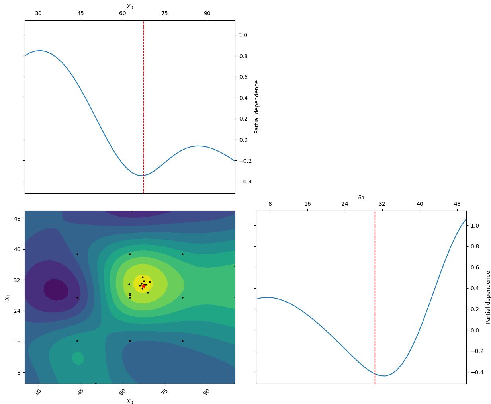

## Example 6: Autonomous Process Optimization
From the main readme:
>Example 6 emulates optimization of a material processing experiment. It uses a fake measurement device (DummyMeter) that 'measures' some property from a random noisy objective function surface that depends on a DummyHeater's temperature and a DummyMotor's speed. You can think of it as corresponding to some process like 3d printing or ink coating (i.e. What printing temperature and speed gives me the best material property?).
>
>Example 6 generates a random objective function each time. Below is an example of the results after running 30 iterations of the mock experiment. After 30 iterations the minimum is found at a temperature of 67.3 and a speed of 30.4, near the true minimum.

### True objective function without noise

### Convergence plot

### Estimated objective function and evaluations

